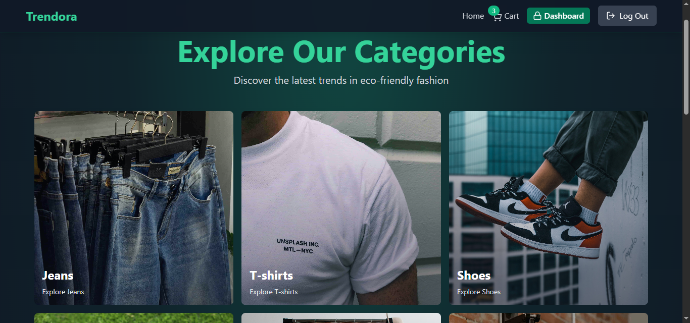
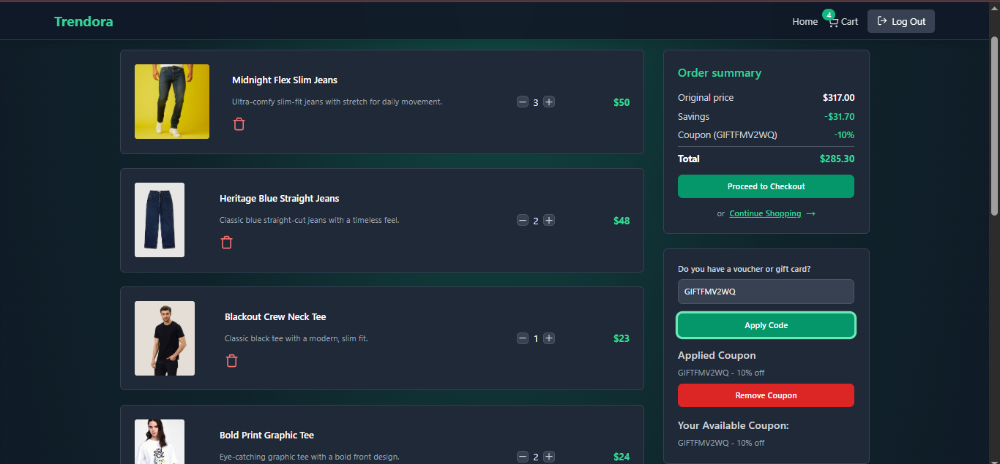
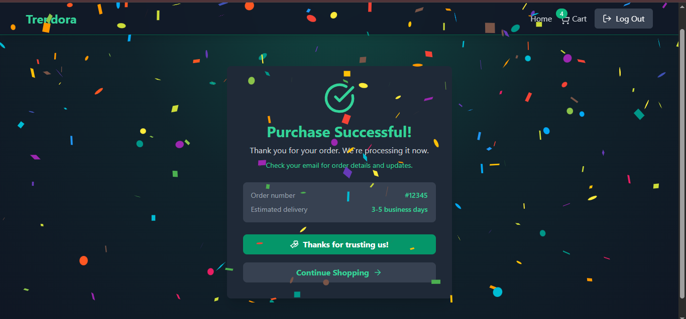
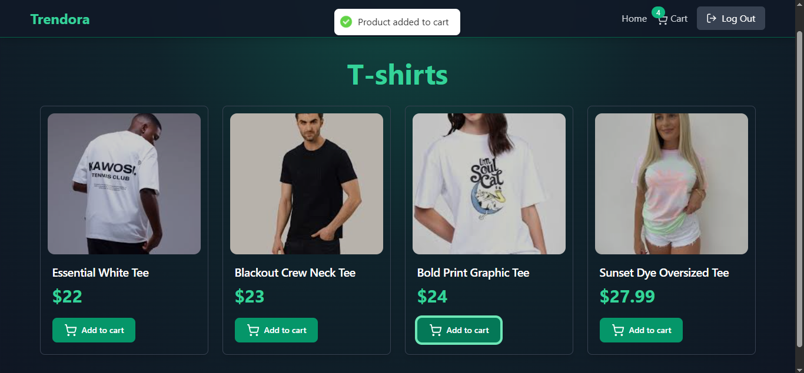
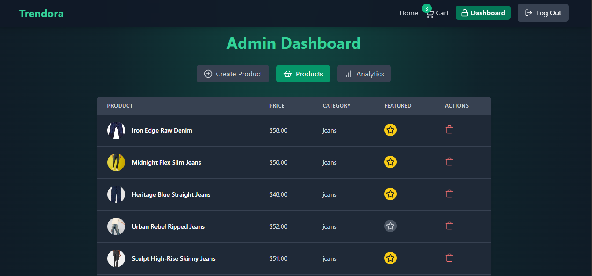
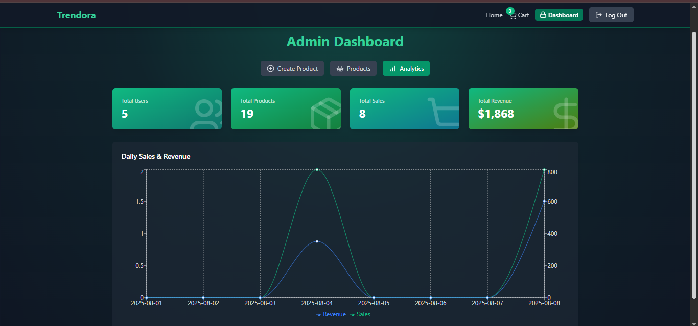

# Trendora – Full Stack Fashion E-Commerce Platform

Trendora is a full-stack fashion e-commerce application that offers a seamless shopping experience with secure authentication, dynamic cart management, admin product control, and Stripe-powered payments.

## 🚀 Live Demo

🔗 [Live Website](https://trendora-frxm.onrender.com)  

## 📸 Screenshots  

---

## ⚙️ Tech Stack

- **Frontend:** React.js, Tailwind CSS, Framer motion, Recharts, Zustand
- **Backend:** Node.js, Express.js
- **Database:** MongoDB
- **Authentication:** JWT (Access & Refresh Tokens)
- **Payments:** Stripe API
- **Session & Caching:** Redis
- **Deployment:** Render

---

## 🔑 Key Features

- 👤 Secure user authentication with JWT (access & refresh tokens)
- 🛍️ Product listing with dynamic category filtering and search
- 🛒 Shopping cart with real-time updates and checkout flow
- 💳 Stripe integration for secure and smooth payments
- 🎟️ Coupon-based discount system for flexible pricing
- 🧑‍💼 Admin dashboard with full CRUD capabilities, user sales and analytics
- 📱 Fully responsive design for mobile, tablet, and desktop

---

## 📬 Contact

**Victor Akpobasa (SamVic Codes)**  
📧 Email: [victorakpobasa2020@gmail.com](mailto:victorakpobasa2020@gmail.com)  
🐦 Twitter: [@SamVicCodes](https://x.com/SamVicCodes)  
📱 Linkedin: [SamVicCodes](https://www.linkedin.com/in/samviccodes)